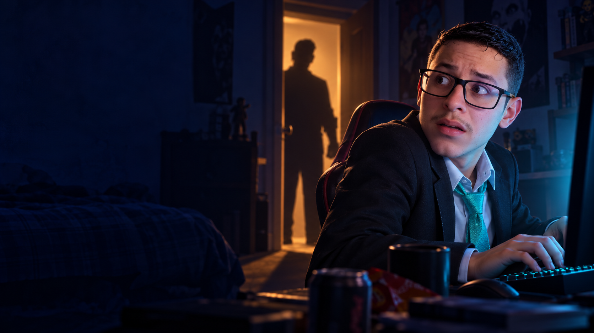

# Tico's House

Terror com comédia em primeira pessoa: Gustavo prometeu desligar o computador às 21h, mas entrou em mais uma partida com os amigos. O quarto, o FPS e a casa continuam funcionando ao mesmo tempo.

**Versão 0.1.8 — Windows x64.**

## Objetivo

Sair de **Platina 3 — 0 PDL** e alcançar **100 PDL / Diamante** antes das 06h, sem Tico descobrir. Habilidade rende mais PDL; menos partidas significam menos tempo exposto.

## Mecânicas

- Quarto 3D com computador, monitor ao vivo, teclado, cadeira, cama, janela e corredor.
- Minijogo de mira exclusivamente na Ascent: câmera fixa, imagem pixelada, mira livre, inimigos AD–AD, tiros, headshots, recarga, pulso e partidas até 13 rounds.
- Gust e quatro amigos sorteados: Joaobuild, Trolezi, Carlos, Loogins, Tavinho e Munhak. Carlos e Munhak têm habilidade inferior, com raras exceções.
- PDL por kills, deaths, assists, headshots, precisão, MVP, clutches, multi-kills, rounds decisivos e mortes precoces. Vitórias rendem 15–40; derrotas removem 12, sem descer abaixo de zero.
- Microfone fictício: aberto favorece comunicação e reduz estresse, mas faz barulho; mutado prejudica o time sem determinar automaticamente a derrota.
- Volume do FPS independente: sons da arena se misturam aos sons espaciais da casa.
- Estresse, barulho e suspeita invisível interagem com o relógio e os estados de Tico.
- Ronco, falsos alarmes, escadas, passos, porta, inspeção e falsa saída.
- Guilherme pode ajudar, errar ou sair. Meliça pode avisar, latir ou receber carinho.
- Corte de Wi-Fi irreversível: nenhum esconderijo ou vitória pode interromper o Final Hunt.
- Cinco finais e registro local dos finais descobertos.

## Como jogar

Use fones. Aproxime-se da cadeira e pressione E para sentar. O cursor fica livre: clique no botão **Buscar partida** ou pressione Enter. Durante o combate, o mouse move a mira sobre a imagem fixa da Ascent. Jogue bem para ganhar mais PDL, mas escute o ronco e a casa. Ao suspeitar de uma visita, desligue o monitor, levante, caminhe até a cama e deite. Espere sinais sonoros de que é seguro levantar: passos que se afastam podem ser falsos. Sair da janela pausa a noite automaticamente.

A partida continua enquanto você se esconde; ficar ausente pode custar rounds. O relógio vai de 21h a 06h em 21 minutos reais, sem contar pausas. Na Ascent, apenas a mira se move; os inimigos fazem AD–AD. Cada round dura até 18 segundos e termina por eliminação ou limite de tempo; no limite, Gust perde se ainda houver defensores vivos.

## Controles

| Tecla | Ação |
|---|---|
| WASD | Movimento |
| Mouse | Olhar no quarto / mover a mira sobre a imagem da Ascent |
| E | Sentar, levantar, deitar ou fazer carinho quando próximo |
| F | Ligar/desligar monitor próximo à mesa |
| Clique em Buscar partida / Enter | Procurar nova partida enquanto sentado |
| Botão esquerdo | Atirar |
| R | Recarregar |
| Q | Pulso tático que prejudica a precisão inimiga temporariamente |
| Shift | Correr no quarto |
| Tab (segurar) | Placar do time |
| M | Mutar/desmutar microfone fictício |
| V | Mutar/restaurar áudio do FPS |
| − / + | Diminuir/aumentar volume do FPS |
| Alt + roda do mouse | Ajustar volume do FPS |
| Esc | Pausa, opções de áudio/sensibilidade e reinício |

O jogo não acessa seu microfone, Discord ou roteador reais. Toda comunicação e queda de conexão são ficcionais e locais.

## Download

Baixe em [Tico's House v0.1.8](https://github.com/joaobuild/Ticos-House/releases/tag/v0.1.8). Extraia a pasta inteira e abra `TicosHouse.exe`. Não é necessário instalar Unity.

## Desenvolvimento

- Unity **6000.3.14f1 (Unity 6.3 LTS)**.
- C#, pipeline Built-in, Windows x64, backend Mono.
- Geometria própria para a casa, efeitos sintetizados e falas provisórias em português. Após revisão do usuário, o minijogo passou a usar ilustrações de fã da Ascent e dos agentes Jett, Phoenix, Sage, Reyna e Omen. Veja [procedência e prompts](Docs/ART.md).
- Gustavo usa terno, camisa branca, gravata turquesa e óculos; Guilherme tem cabelo bagunçado e camisa azul; Tico tem camisa listrada, barba e cinto como adereço; Meliça tem pelo irregular e laço rosa.
- As fotografias de referência não são incluídas no repositório ou no executável.

A cena e os objetos são montados automaticamente pelo código, sem configuração manual. `BuildGame.Windows` cria a cena de entrada e compila para `Builds/TicosHouse/TicosHouse.exe`. Abra a pasta na versão indicada da Unity e use **Tico's House → Build Windows x64**, ou execute `Tools/build-windows.ps1` com o caminho do editor licenciado.

## Testes

`Tools/test-simulation.ps1` executa o núcleo sem depender de licença Unity: faixas de PDL, progressão, morte irreversível, detecção, cama, monitor, pausa, reinício e simulação de 30 noites completas.

O executável também contém `--smoke-test`, que instancia o quarto e os nove bots, inicia uma partida e testa Final Hunt na cama. Isso complementa os testes manuais; não substitui a validação visual e de jogabilidade.

Veja [TESTING.md](Docs/TESTING.md) e [ARCHITECTURE.md](Docs/ARCHITECTURE.md).

## Limitações conhecidas

- Personagens e animações são modelos geométricos provisórios, não esculturas detalhadas das fotos.
- Ascent em enquadramento fixo, uma arma e um pulso; aliados simulados fora da tela; não há multiplayer real.
- IA simplificada, sem economia, plantio de objetivo ou movimentação do jogador pelo mapa.
- Áudio sintetizado e vozes provisórias; volume geral ajustável em Esc. A mixagem foi reduzida após o primeiro playtest.
- A distribuição real de vitórias por noite precisa de playtests humanos; testes matemáticos não provam balanceamento ou diversão.
- Interface usa teclado/mouse e escala de referência 1280×720; não há suporte a controle.

## Créditos

Conceito e personagens: grupo de amigos do Joaobuild. Implementação: projeto desenvolvido com assistência do Codex. Valorant, Ascent e os agentes pertencem à Riot Games. Projeto de fã não oficial, sem afiliação ou endosso.

### Combate 0.1.1

Gust tem 150 HP por round. Inimigos disparam traçantes e causam dano. Cada kill de Gust alterna o enquadramento da Ascent (Mercado B, bomb A, quadrado/varanda), preservando vida e munição. Fundos são interpretações artísticas de fã, sem navegação 3D no minijogo.

### Dificuldade 0.1.2

Inimigos fazem arrancadas e mudanças aleatórias de direção, com pausas curtas. Entram mais rápido e atiram com maior frequência e precisão. Cinco locais da Ascent: Mercado B, bomb A/Heaven, quadrado/varanda, bomb B/Boathouse e Árvore/Jardim. Gust mantém 150 HP e tempo de reação na troca.

### Combate e comunicação 0.1.3

Inimigos entram a cada 0,65 s e atiram a cada 0,32–0,56 s após o tempo inicial de reação. Acertos podem ser headshots (22% dos acertos; 75–95 de dano) ou tiros no corpo (26–36). Gust continua com 150 HP. Comunicação e estresse afetam a cadência e precisão dos aliados; aliados vivos oferecem cobertura, dividindo o foco inimigo. Acertos aliados suprimem a precisão do alvo por 0,65 s. Mortos não oferecem cobertura. Mutado ainda é possível vencer, mas o time ajuda significativamente menos.

### Regras anteriores — 0.1.4

Gust e aliados precisam eliminar os cinco inimigos em 18 segundos. Não basta sobreviver com vantagem numérica. Três inimigos entram juntos; os outros entram logo depois. Cada kill troca o cenário imediatamente, mas NÃO pausa o combate nem reinicia os tiros inimigos. Tiros a cada 0,22–0,38 s; corpo 30–44, headshot 100–125 (30% dos acertos). Vida do Gust permanece 150. Comunicação, cobertura e supressão aliada continuam essenciais para aliviar a pressão.

### Regras atuais — 0.1.5

Apenas UM inimigo aparece e pode atirar por vez. Depois de eliminado por Gust ou por um aliado, o próximo aparece após 0,25 s e usa seu tempo inicial de reação. Inimigos aguardando não atiram nem podem receber dano. Mantidos movimento, tiros rápidos, headshots, 150 HP, comunicação e limite de 18 s. Vida e munição não são recuperadas entre duelos.

### Arma — 0.1.6

Segurar o tiro causa recuo vertical real, desvio lateral e dispersão crescente. Compense puxando o mouse para baixo. A mira abre conforme perde precisão. Rajadas curtas e tiros isolados são mais precisos. Após 0,24 s sem disparar começa a recuperação; um spray máximo recupera totalmente em aproximadamente 0,87 s. Eliminações não reiniciam a precisão. Mantido um inimigo por vez.

### Visual — 0.1.7

Capa com Gust de terno e gravata, integrada ao menu. Quarto com materiais de madeira e tecido, cortinas, detalhes de móveis e luz quente de cabeceira. Personagens com silhuetas arredondadas, detalhes faciais e roupa; Meliça mantém o visual desgrenhado. Antialiasing 4x e até oito luzes por pixel. Arte da capa é ilustrativa; personagens em jogo continuam estilizados e procedurais. Inclui recuo/dispersão da atualização 0.1.6, que ainda não havia sido publicada.

### Áudio — 0.1.8

13 falas neurais em português, quatro trechos de ronco humano gravado, filtros de distância, passos com variações e canais dedicados para ronco e diálogo. Efeitos do FPS abaixam durante falas, sem zerar os sons da casa. Os áudios são incluídos na build e não exigem internet. Vozes são sintéticas, não clonagens das pessoas. Créditos do ronco em Docs/AUDIO-CREDITS.md e no StreamingAssets da build.

Bots ligeiramente aliviados: intervalo 0,25–0,42 s entre tiros e headshot em 27% dos acertos; mantidos dano e duelos individuais.
